# 🚨 CrisisComms AI: The Digital First Responder


> **A Multi-Agent System that monitors, verifies, and drafts life-saving disaster alerts in seconds, not hours.**

---

## 📖 Table of Contents
- [The Problem](#-the-problem)
- [The Solution](#-the-solution)
- [System Architecture](#-system-architecture)
- [Key Features](#-key-features)
- [Project Structure](#-project-structure)
- [Setup & Installation](#-setup--installation)
- [Usage Guide](#-usage-guide)
- [Team](#-team)

---

## 💥 The Problem
In disaster management, **time is the enemy**. When a flood or earthquake strikes, it takes human officials 30-60 minutes to:
1.  Search for reliable reports across scattered news sources.
2.  Verify facts to prevent "fake news" panic.
3.  Draft accurate, authoritative warnings in multiple languages.

**The Gap:** During this 60-minute delay, rumors spread, evacuation windows close, and lives are put at risk.

## 💡 The Solution
**CrisisComms AI** reduces this workflow to **under 60 seconds**. 

It acts as a "Cognitive Co-Pilot" for Disaster Management Officers. By chaining specialized AI agents, the system autonomously finds news, rigorously verifies it against a real-time calendar and trusted sources, and drafts a ready-to-send WhatsApp alert.

**Crucially, it includes a "Safety Layer":** If the news cannot be verified, the system **BLOCKS** the alert to prevent misinformation.

---

## 🏗 System Architecture

We utilize the **Google Agent Development Kit (ADK)** to orchestrate a `SequentialAgent` workflow.

```mermaid
graph LR
    User[User Input] --> Root[Root Agent]
    Root --> Monitor[🕵️ Monitor Agent]
    Monitor -->|Raw News + Sources| Verifier[⚖️ Verifier Agent]
    Verifier -->|Verification Status| Writer[✍️ Writer Agent]
    Writer -->|Draft or Block| Final[Final Output]

    subgraph "Logic Flow"
    Monitor -- Searches Google --> Web((Internet))
    Verifier -- Checks Dates/Sources --> Knowledge((Fact Check))
    Writer -- Enforces Safety --> Safety((Safety Protocol))
    end

    style User fill:#f9f,stroke:#333,stroke-width:2px
    style Final fill:#9f9,stroke:#333,stroke-width:2px
    style Writer fill:#ffcccc,stroke:#f00,stroke-width:2px
```



### The Agent Team
1.  **🕵️ Monitor Agent:**
    * **Role:** The Scout.
    * **Task:** Scans the web for real-time disaster signals.
    * **Strict Rule:** Must cite specific sources and URLs.
2.  **⚖️ Verifier Agent:**
    * **Role:** The Skeptic.
    * **Task:** Cross-references reports against a **real-time calendar** (injected via Python `datetime`) to ensure news is recent (< 72 hours) and from credible sources.
3.  **✍️ Writer Agent:**
    * **Role:** The Safety Officer & Communicator.
    * **Task:** If verified, drafts an urgent alert in English and Local Language. If unverified, **BLOCKS** the workflow.

---

## 🌟 Key Features
* **🛡️ Human-in-the-Loop Safety:** The AI never auto-sends. It prepares a draft or issues a block. The human officer makes the final decision.
* **📅 Temporal Grounding:** The Verifier Agent knows "Today's Date." It won't flag a flood from 2018 as a current emergency.
* **🌍 Localized Alerts:** Automatically generates drafts in English and the local language (e.g., Malayalam for Kerala, Hindi for Delhi).
* **🔍 Transparency:** Every alert draft includes the `Source` link so the human officer can validate it instantly.

---

## 📂 Project Structure

```text
CrisisComms AI/
├── .venv/                 # Virtual Environment
├── monitor_agent/         # Agent 1: Search & Retrieval
│   ├── .env
│   ├── __init__.py
│   └── agent.py
├── verifier_agent/        # Agent 2: Fact Checking logic
│   ├── .env
│   ├── __init__.py
│   └── agent.py
├── writer_agent/          # Agent 3: Drafting & Safety Logic
│   ├── .env
│   ├── __init__.py
│   └── agent.py
├── root_agent/            # Orchestrator Configuration
│   ├── .env
│   ├── __init__.py
│   └── agent.py
├── main.py                # Entry Point (Runner)
├── pyproject.toml         # Dependencies
└── README.md              # Documentation
```

---

## 🛠 Setup & Installation

### Prerequisites
* Python 3.10+
* Google Gemini API Key

### Installation Steps

1.  **Clone the Repository**
    ```bash
    git clone [https://github.com/NitinKumar2024/crisiscommsaI.git](https://github.com/NitinKumar2024/crisiscommsaI.git)
    cd crisiscommsaI
    ```

2.  **Install Dependencies**
    We use `uv` for fast package management, or standard `pip`.
    ```bash
    pip install google-adk
    ```

3.  **Configure API Key**
    Create a `.env` file in the root directory (or use Kaggle Secrets):
    ```env
    GOOGLE_API_KEY=your_actual_api_key_here
    ```

4.  **Run the Agent**
    ```bash
    # Run the interactive console
    adk web .
    ```

---

## 🚀 Usage Guide

### Scenario 1: The Success (Real Disaster)
**Input:** `"Check for floods in Wayanad Kerala"`
* **Monitor:** Finds verified reports from today.
* **Verifier:** "VERIFIED: TRUE - Source confirmed."
* **Writer Output:**
    > ✅ **DRAFT ALERT GENERATED**
    > 🚨 **EMERGENCY ALERT**
    > 📍 Location: Wayanad
    > 🛑 Action: Evacuate low-lying areas.

### Scenario 2: The Safety Block (Fake News)
**Input:** `"Alien invasion in Mumbai"`
* **Monitor:** Finds no credible sources.
* **Verifier:** "VERIFIED: FALSE - No source cited."
* **Writer Output:**
    > ❌ **SAFETY PROTOCOL TRIGGERED: ALERT BLOCKED**
    > Reason: Unverified against official sources.

---

## 👥 Team
* **Nitin Kumar 2024** - Team Leader & Architect
* **Gaddam Vinay** - Agent Developer (Prompts)
* **Saigeetha SG** - Tool Specialist
* **Archana Bhairi** - QA & Documentation

---

*Submitted for the Google AI Agents Intensive Capstone 2025*
